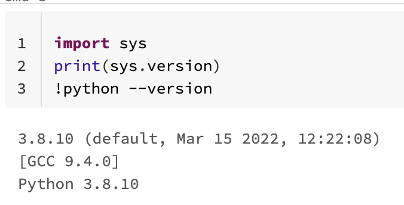
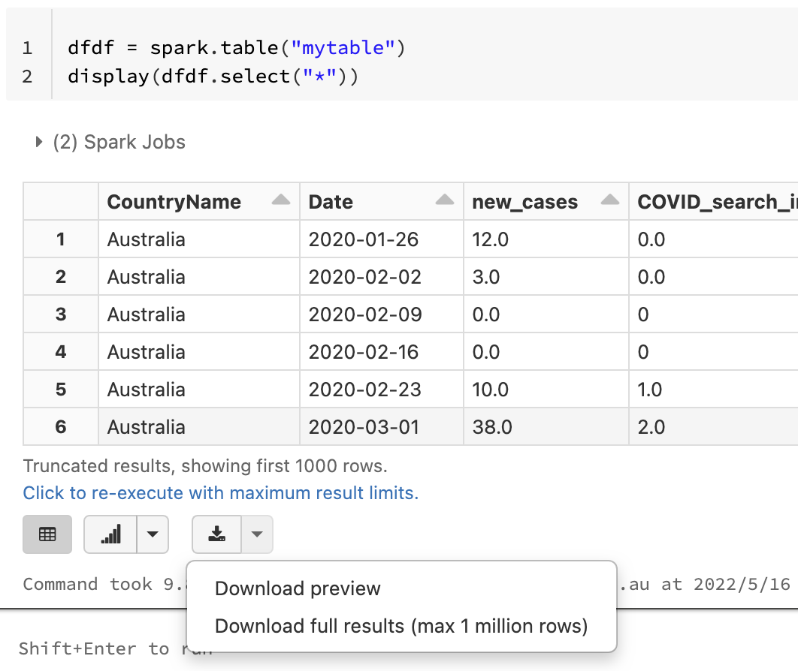

# DATA3888

## Dataset

Our data comes from these two sites:

Google Search Index: https://trends.google.com/trends/explore?geo=US&q=COVID (Filtered trends in searches for "COVID", "education", "flight", "export", "immigration", "lockdown", "marriage", "mask", "medicaltreatment", "socialdistance", "travel", "vaccine", "wfh".)

COVID-19 dataset: https://github.com/owid/covid-19-data/tree/master/public/data

We select data from 'owid-covid-data.csv' for 25 countires, and data in the world ('Australia', 'Belgium', 'Brazil', 'Canada', 'China HongKong', 'France', 'Germany', 'India', 'Israel', 'Italy', 'Japan', 'Netherlands', 'Qatar', 'Russia', 'Saudi Arabia', 'Singapore', 'South Korea', 'Spain', 'Switzerland', 'Thailand', 'Turkey', 'United Arab Emirates', 'United Kingdom', 'United States', 'Vietnam', 'World').

Because Google's data can only download one csv file containing one search term in one country at a time. So there are 339 data sets (13*26+1, 13 is 13 hot words, 26 is 25 countries + 1 world, 1 is covid-19 dataset).

There are 27 folders in DataSet directory. The "DataSet" directory contains 27 folders, 13 of which are used to store the data of 13 hot words downloaded from Google Trend (each folder contains 26 CSV files, including 25 countries and one global file). Another 13 folders are used to store the processed data for the 13 hot words (more information will be introduced later in the Python file part), and the last folder is used to store the final processed data file.

All data used in this project is from 'Percent_COVID_Index.csv', which is save in RMarkdown folder. 

## Python file

We use python to clean 339 datasets and merge them into one csv file. So there are 7 py files and 1 ipynb file.

- **DataSet/clean.py**: Python code to select 25 countries from the original data set with seven columns (country name/location, date, new_cases, new_deaths, new_tests, positive_rate, new_vaccinations). 

  In terminal, run 'python3 clean.py' and it will automatically clean the data from 'owid-covid-data.csv' and save the result to "Countries_cases.csv" in the same directory.

- **DataSet/week_data.py**:  Because the original data is recorded daily new_case changes. We want to explore weekly data. So the data needs to be grouped into seven-day groups. And we also processed the empty data. 

  In terminal, run 'python3 week_data.py' and it will automatically process data from 'Countries_cases.csv' and save the result into 'Final Dataset/weekly_world_cases.csv'. 

- **DataSet/clean_Google.py**: Because there are 13 hot words, there are 13 folders for storing data. Each folder contains 26 CSV files for 25 countries and one for the world. clean_Google.py will clean up the original data, delete empty data, delete random characters. The new csv file will be saved into 13 new folders.

  In terminal, run 'python3 clean_Google.py', and it will ask you to enter an input folder name(directory name). There are all folder names, you can choose one as input: 

  - GoogleSearch_origin
  - Education
  - Travel
  - Export
  - Immigration
  - Lockdown
  - Marriage
  - Mask
  - Medical_treatment
  - Social_distance
  - Vaccine
  - WFH
  - Flight

  Then, it will ask you to enter an output folder name. There are all folder names (you can choose one of them as input):

  - Google_new_eachCountry
  - Education_new
  - Travel_new
  - Export_new
  - Immigration_new
  - Lockdown_new
  - marriage_new
  - Mask_new
  - medical_treatment_new
  - Social_distance_new
  - Vaccine_new
  - WFH_new
  - Flight_new

- **DataSet/merge.py**: There are 13 new folders, each containing 26 CSV files. This code merges the 26 files in each folder into one file and saves it in the 'Final Dataset' folder. Thirteen new files will be generated. 

  In terminal, run 'python3 merge.py', and it will ask you to enter a directory name:

  - Google_new_eachCountry
  - Education_new
  - Travel_new
  - Export_new
  - Immigration_new
  - Lockdown_new
  - marriage_new
  - Mask_new
  - medical_treatment_new
  - Social_distance_new
  - Vaccine_new
  - WFH_new
  - Flight_new

  Also, you need to givt the output file a name. I named all the files "AllCountries_Word", such as "AllCountries_Education.csv", 'AllCountries_Export.csv', 'AllCountries_Social_distance.csv'. 

  There are three columns in AllCountires_xxx.csv (Country, Date, Search_Index)

- **DataSet/Final Dataset/merge_both.py**: Integrate weekly_world_case.csv with 13 AllCountries CSV files one by one. The result is 13 new CSV files. Each file has 4 columns(country, date, Search_Index and new_cases).

  In terminal, run 'python3 merge_both.py' and it will ask you enter filename you want to merge. Because the code automatically fills in the words "AllCountries_",  you only need to type the hot word. There are 13 hot words: 

  - Search
  - Education
  - Travel
  - Export
  - Immigration
  - Lockdown
  - Marriage
  - Mask
  - Medical_treatment
  - Social_distance
  - Vaccine
  - WFH

  Then, it will ask you to enter output filename. I named all files "finalXXXX", such as "finalEducation.csv", "finalSocialDistance.csv" and so on.

- **DataSet/Final Dataset/csv_processor.py**: This code calculates the growth rate of 13 Search indexes and new cases. And save the results to a new CSV file. There will be 13 new CSV files. 

  In terminal, run 'python3 csv_processor.py finalXXX.csv output_filename.csv', such as "python3 csv_processor.py finalFlight.csv new_Flight.csv". First argument is input file, second argument is output file. 

- **DataSet/Final Dataset/JoinCSV.ipynb**: I use pyspark to merge 13 files into one CSV file. You can open ipybn in the databrick platform. Python version in databrick is: 3.8.10  [GCC 9.4.0]. 

  

  At the end of the notebook, the code will generate a dataframe, click "Download full result (max 1 million rows)"

  

  We stored this csv file in 'Final Dataset/' and named it 'Final-COVID-Index.csv'

- **DataSet/population.py**: It divides the new_case in final-covid-index.csv by the population in the corresponding country in the owid-covid-date :
  $$
  (new_case/population)*1000
  $$
  So for the sake of observation and calculation, we multiply this by 1000 here.

  In terminal, run 'python3 population.py'. The final csv file named 'Percent_COVID_Index.csv' will be save into Rmarkdwon folder,  which is also used to hold R files. All data used in this project is from 'Percent_COVID_Index.csv'

## Project and Report RMarkdown

The project's code and reports are integrated into an Rmd file called "Report." This file is saved in the RMarkdown directory. Completed Code red file is saved in the RMarkdown directory.

## Shiny App

The code for Shiny App and associated data files are stored in directories for Shiny.

Shiny web page link: https://covidp1.shinyapps.io/covid_p1/
